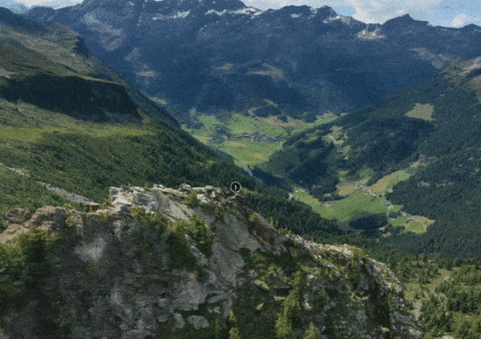

# equirectangular-Sphere-Mesh
An equirectangular Sphere Mesh used for skyboxes. The mapping in Engines is usually done in shader, saving the uv channels for mappings friendlier for procedural skyboxes, sampling textures such as clouds etc. This mesh however is unwrapped in a way so that it can take a equirectangular pano and look like the shader mapping counterpart. I am using it for Sketchfab scenes where there is no shader access. Full article on how to integerate it in Sketchfab:
https://medium.com/@shahriyarshahrabi/skybox-in-sketchfab-a761f336d74c

